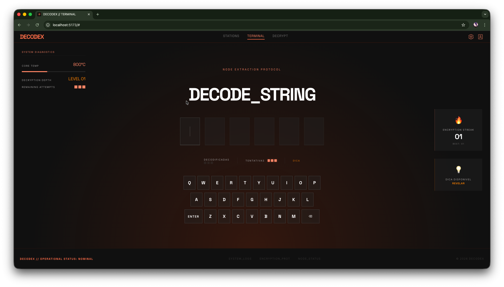

<div align="center">

# &lt;/DECODEX&gt;

### Neural Decryption Protocol

Um jogo de decodificação de palavras com estética cyberpunk, construído com React e TypeScript.


[Live Demo](https://decodex-tau.vercel.app) · [Reportar Bug](https://github.com/juninalmeida/decodex/issues)

</div>

---

## Sobre o Projeto

**DECODEX** é um word-guessing game inspirado no Wordle, ambientado em um terminal cyberpunk. O jogador precisa decodificar **3 palavras** em sequência para completar o protocolo, com apenas **3 tentativas** por rodada.

O projeto foi desenvolvido com foco em demonstrar domínio dos **fundamentos do React** — gerenciamento de estado, componentização, custom hooks, tipagem com TypeScript e estilização responsiva sem bibliotecas externas.

### Preview

<div align="center">



</div>

## Funcionalidades

- **Sistema de decodificação** — Adivinhe palavras de 6 letras com feedback visual por letra (correto, deslocado, errado)
- **Progressão em 3 palavras** — Complete 3 palavras em sequência para vencer a rodada
- **Detecção inteligente de letras** — Algoritmo de contagem que lida corretamente com letras duplicadas
- **Teclado virtual e físico** — Suporte completo para input via mouse/touch e teclado do dispositivo
- **Sistema de dicas** — Dicas contextuais em português para cada palavra
- **Streak tracking** — Persistência de sequência de vitórias e melhor recorde via localStorage
- **Animações de feedback** — Revelação em cascata, shake em erro e pop nas teclas
- **Loading screen** — Tela de inicialização temática com animações de scanner
- **Design responsivo** — Layout adaptativo com painéis laterais que aparecem em telas maiores (1200px+, 1400px+)

## Fundamentos React Demonstrados

| Conceito | Aplicação no Projeto |
|----------|---------------------|
| **Componentização** | 11 componentes isolados, sem lógica interna |
| **Custom Hooks** | `useGame` centraliza toda a lógica do jogo (~250 linhas) |
| **useState** | 13 estados gerenciados no hook principal |
| **useEffect** | Registro de event listener do teclado com cleanup |
| **useRef** | Ref para handlers do teclado, evitando re-registro a cada render |
| **Props & Tipagem** | Todos os componentes com tipos TypeScript explícitos |
| **Renderização condicional** | Telas de vitória/derrota, dica, painéis responsivos |
| **Listas & Keys** | Renderização de slots, teclas e indicadores de progresso |
| **Persistência** | Hook genérico `useLocalStorage<T>` com tipo seguro |
| **Levantamento de estado** | Estado centralizado no hook, distribuído via props |

## Arquitetura

```
src/
├── pages/
│   └── Terminal/              # Página principal do jogo
├── components/
│   ├── Header/                # Navegação com ícones SVG
│   ├── Footer/                # Rodapé com links
│   ├── WordDisplay/           # Grid de slots das letras
│   ├── LetterSlot/            # Célula individual com status visual
│   ├── Keyboard/              # Teclado QWERTY virtual
│   ├── KeyButton/             # Tecla individual com estado de cor
│   ├── GameStatus/            # Painel de progresso + tela de resultado
│   ├── SidePanel/             # Diagnósticos do sistema (desktop)
│   ├── SideCards/             # Cards de streak e dica (desktop)
│   ├── LoadingScreen/         # Splash screen animada
│   └── icons/                 # Componentes SVG (Settings, User)
├── hooks/
│   ├── useGame.ts             # Lógica completa do jogo
│   └── useLocalStorage.ts     # Persistência genérica tipada
├── data/
│   └── words.ts               # Lista de palavras + dicas
├── types/
│   └── game.ts                # Tipos compartilhados
└── styles/
    ├── reset.css              # CSS reset
    └── global.css             # Design tokens (CSS Custom Properties)
```

## Stack

- **React 19** — Biblioteca UI com function components
- **TypeScript** — Tipagem estática em todo o projeto
- **Vite 8** — Build tool e dev server
- **CSS puro** — Sem frameworks CSS; design system via Custom Properties, layout com Flexbox, responsividade com `clamp()` e media queries
- **localStorage** — Persistência client-side para streak

> Zero dependências externas além de React. Todo o visual, animações e lógica foram implementados do zero.

## Rodando Localmente

```bash
# Clone o repositório
git clone https://github.com/juninalmeida/decodex.git

# Entre no diretório
cd decodex

# Instale as dependências
npm install

# Inicie o servidor de desenvolvimento
npm run dev
```

O projeto estará disponível em `http://localhost:5173`.

### Scripts

| Comando | Descrição |
|---------|-----------|
| `npm run dev` | Inicia o servidor de desenvolvimento |
| `npm run build` | Gera o build de produção (`tsc -b && vite build`) |
| `npm run preview` | Preview local do build de produção |

## Autor

<div align="center">

**Horácio Junior**

[](https://www.linkedin.com/in/j%C3%BAnior-almeida-3563a934b/)
[](https://github.com/juninalmeida)
[](mailto:junioralmeidati2023@gmail.com)

</div>

---

<div align="center">

Feito com React + TypeScript

</div>
